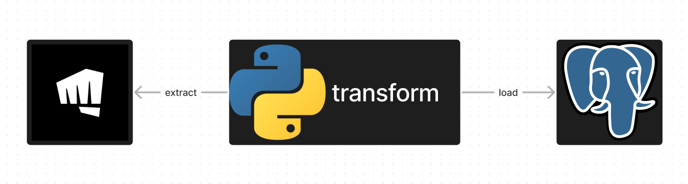

# Challengers rank

Example ETL jobs that retrieves data about challenger players from Riot Developer API. Only relevant data was extracted 
(summonerId, leaguePoints, wins, losses and summonerName). To provide historical data for analyze purposes i used SCD(Slowly Changing Dimension). 
New columns have been added (dim_key, valid_from, valid_to, iscurrent) according to scd rules. Data is saved in Postgres database.



## Requirements

[Docker](https://www.docker.com/)


## Run ETL job
Build docker image
```sh
./build.sh
```

2. Run docker image
```sh
./run.sh
```
